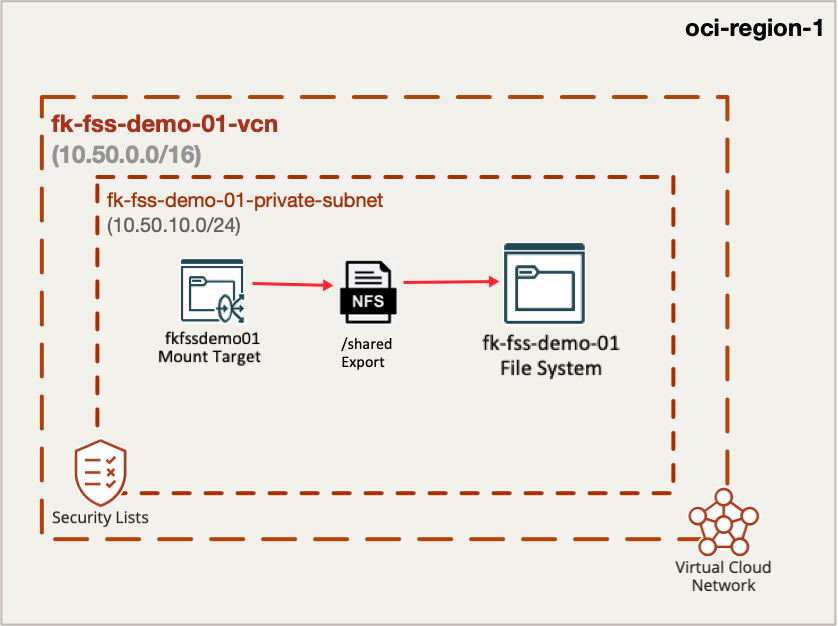
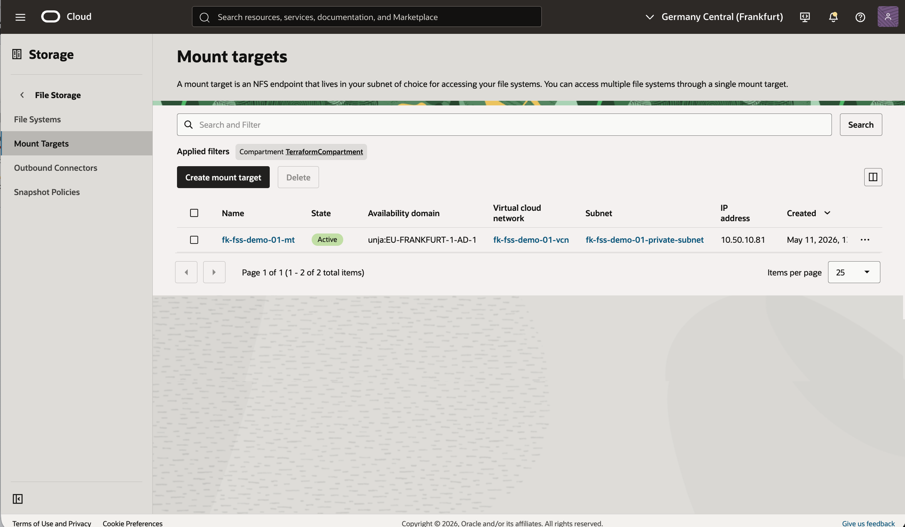
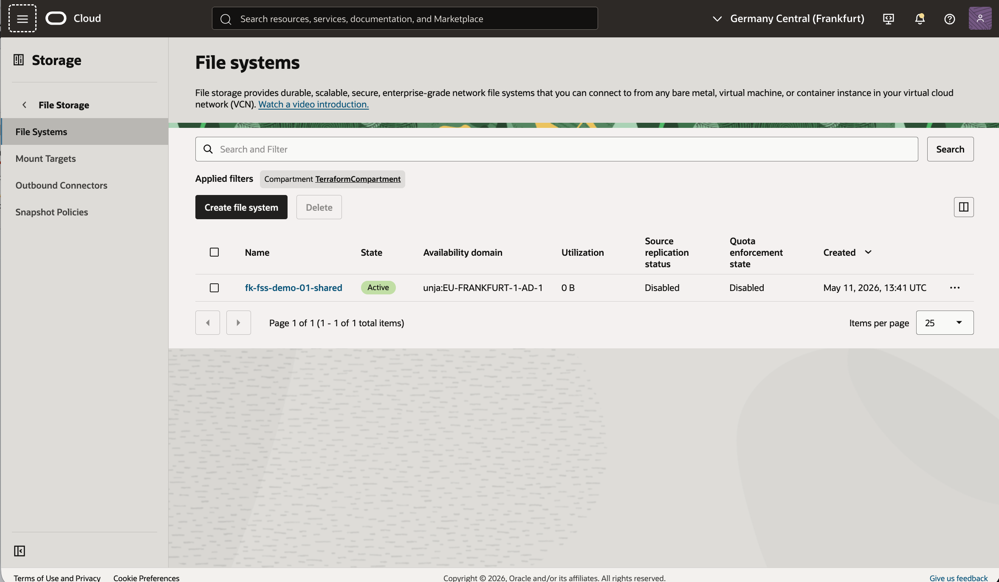
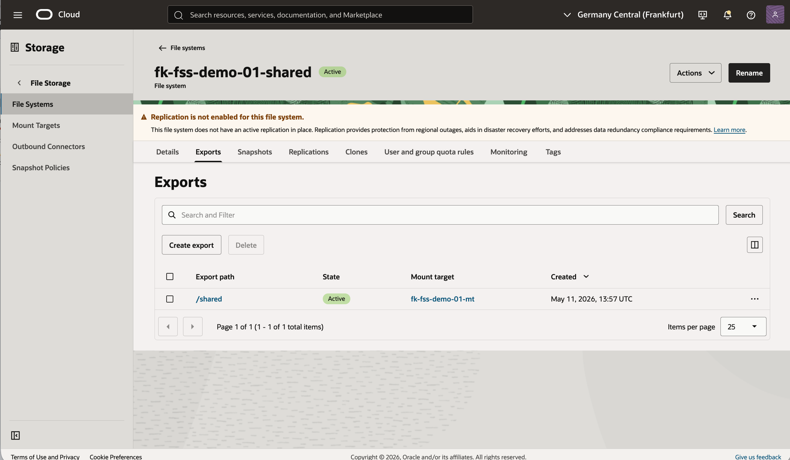

# Example 01: Single File System with Single Export

This example deploys the smallest practical **OCI File Storage** setup using **Terraform/OpenTofu**:
one mount target, one file system, and one export placed in a **private subnet**.

The goal is to show the most direct consumption pattern for this module without mixing in compute, autoscaling, or other infrastructure layers.

---

## Architecture Overview



This deployment creates:

- one dedicated **VCN**
- one **private subnet** for the mount target
- one OCI **File Storage mount target**
- one OCI **file system**
- one OCI **export** mounted as `/shared`

The subnet security list is configured with sample NFS-related ingress rules so client workloads inside the VCN can reach the mount target.

---

## Deployment Steps

Initialize and apply the Terraform/OpenTofu configuration:

```bash
tofu init
tofu plan
tofu apply
```

If you prefer Terraform:

```bash
terraform init
terraform plan
terraform apply
```

After a successful deployment, Terraform will output:

- the mount target private IP
- the file system IDs
- the ready-to-use export target in `ip:/path` format

---

## OCI Console And Runtime Verification

### Mount Target



This view confirms that the mount target is deployed in the expected private subnet and is ready to host exports for client workloads inside the VCN.

### File System



This view confirms that the example created the OCI File Storage file system associated with the module invocation.

### Export



This view confirms that the `/shared` export exists and is attached through the mount target so clients can mount it using the exported NFS path.

---

## What This Example Demonstrates

- how to place OCI File Storage in a private subnet
- how to create a single file system and export with this module
- how to define client export options for a VCN CIDR
- how to combine the module with `terraform-oci-fk-vcn`

---

## Cleanup

To remove all resources created by this example:

```bash
tofu destroy
```

Or with Terraform:

```bash
terraform destroy
```

---

## Learn More

Visit [FoggyKitchen.com](https://foggykitchen.com/) for OCI, multicloud, and Terraform/OpenTofu learning resources.

---

## License

Licensed under the **Universal Permissive License (UPL), Version 1.0**.  
See [LICENSE](../../LICENSE) for more details.

---

© 2026 [FoggyKitchen.com](https://foggykitchen.com) - Cloud. Code. Clarity.
